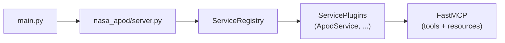

# CLAUDE.md

This file provides context for AI coding agents (Claude Code, Cursor, agentic frameworks). It is the primary entry point for any agent working on this codebase.

## Project Summary

MCP Factory is an extensible MCP (Model Context Protocol) server framework built on FastMCP with a service plugin architecture. Ships with a NASA APOD (Astronomy Picture of the Day) service as a reference implementation. Designed to be extended with additional API services or forked as a template for new MCP server projects.

## Key Commands

```bash
uv sync                  # Install dependencies
uv run main.py           # Start the MCP server (stdio transport)
uv run pytest -v         # Run all tests (unit + E2E)
uv run pytest tests/test_e2e.py -v  # Run E2E tests only
```

## Architecture



- `main.py` is a thin entry point that calls `mcp.run(transport="stdio")`.
- `nasa_apod/server.py` creates the FastMCP instance, builds a `ServiceRegistry`, registers service plugins, and applies them.
- Each service plugin implements `register(mcp: FastMCP)` which uses `@mcp.tool()` and `@mcp.resource()` decorators to wire endpoints.

### Base Abstractions (nasa_apod/services/base.py)

- `BaseAPIClient(ABC)`: `__init__(base_url, api_key, timeout)`, abstract `fetch(**params) -> dict | None`
- `BaseFormatter(ABC)`: abstract `format(data, **kwargs) -> str`
- `ServicePlugin(Protocol)`: requires `register(mcp: FastMCP) -> None`

### Service Registry (nasa_apod/services/registry.py)

- `ServiceRegistry`: `add(plugin)`, `apply_all(mcp)`, `plugins` property

## File Map

```
main.py                                 Entry point
nasa_apod/
  __init__.py                           Package marker
  config.py                             SERVER_NAME constant
  server.py                             FastMCP + ServiceRegistry wiring
  services/
    __init__.py                         Services package marker
    base.py                             BaseAPIClient, BaseFormatter, ServicePlugin
    registry.py                         ServiceRegistry factory
    apod/
      __init__.py                       ApodService (3 tools, 1 resource)
      config.py                         API URL, key, timeout, date constants
      client.py                         ApodClient(BaseAPIClient)
      formatter.py                      ApodFormatter(BaseFormatter)
      validation.py                     validate_apod_date()
tests/
  test_base.py                          ABC contract tests
  test_registry.py                      Registry tests
  test_apod_config.py                   APOD config tests
  test_apod_client.py                   Client tests (respx mocked)
  test_apod_formatter.py                Formatter tests
  test_apod_validation.py               Validation tests
  test_e2e.py                           Full server E2E tests
templates/
  service_template/                     Copy-paste boilerplate for new services
docs/
  ARCHITECTURE.md                       Full architecture documentation
  ADDING-A-SERVICE.md                   Step-by-step new service guide
  ADDING-TOOLS.md                       Tool and resource creation guide
  FORKING-GUIDE.md                      Using this repo as a template
  DEVELOPMENT-WORKFLOW.md               Git, testing, review workflow
  LETS-BUILD-AN-MCP-SERVER.md           Original tutorial guide
  index.html                            Slide deck presentation
```

## How to Add a New API Service

1. Create directory: `nasa_apod/services/<name>/`
2. Create `config.py` with API URL, key (from env var), timeout
3. Create `client.py` extending `BaseAPIClient` with `fetch()` method
4. Create `formatter.py` extending `BaseFormatter` with `format()` method
5. Create `__init__.py` with service class implementing `register(mcp)` that defines tools via `@mcp.tool()`
6. In `nasa_apod/server.py`: import the service class and add `registry.add(YourService())`
7. Write unit tests: `tests/test_<name>_client.py`, `tests/test_<name>_formatter.py`
8. Write/update E2E tests in `tests/test_e2e.py`
9. Run `uv run pytest -v` -- all tests must pass
10. Update `.cursor/rules/mcp-factory-tools.mdc` if the new tool should be used by AI agents

The APOD service (`nasa_apod/services/apod/`) is the canonical reference for this pattern.

## How to Add a Tool to an Existing Service

Inside the service class's `register(mcp)` method:

```python
@mcp.tool()
async def your_tool(param: str) -> str:
    """Clear docstring describing what this tool does and when to use it."""
    data = await client.fetch(param=param)
    if not data:
        return "Error message."
    return formatter.format(data)
```

Tools return strings. They never raise exceptions. The docstring is what the AI agent reads to decide when to call the tool.

## Patterns to Follow

- Extend `BaseAPIClient` and `BaseFormatter` for new services
- Define tools as closures inside `register()` capturing `client` and `formatter`
- Load secrets from environment variables (`os.environ.get`)
- Use `logging` module for errors, never `print()`
- Return `None` from `fetch()` on HTTP/network errors
- Return user-friendly error strings from tools on failure
- Use `respx` for HTTP mocking in tests
- Use `pytest-asyncio` for async tests

## Patterns to Avoid

- Bare `except Exception` -- use specific exception types
- Hardcoded API keys or secrets
- Modifying existing service files when adding a new service
- Raising exceptions from tool functions
- Making real HTTP calls in tests
- Using `print()` instead of `logging`

## Testing Requirements

- Every new module needs a corresponding test file
- E2E tests must verify tool registration and execution through FastMCP
- All existing tests must continue to pass (no breaking changes)
- Run `uv run pytest -v` and verify zero failures before committing

## Dependencies

- `mcp[cli]>=1.26.0` -- MCP SDK with CLI
- `httpx>=0.28.1` -- Async HTTP client
- `pytest>=8.0` (dev) -- Test framework
- `pytest-asyncio>=0.25` (dev) -- Async test support
- `respx>=0.22` (dev) -- HTTP mocking

## Git Workflow

- Branch from `main`: `git checkout -b feature/<name>`
- One logical change per commit, present-tense messages
- All tests must pass before merge
- Merge: `git checkout main && git merge feature/<name>`
