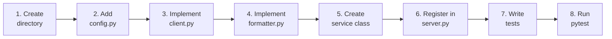

# Adding a New API Service

This guide walks you through adding a new external API as a self-contained service plugin. By the end, your new API's tools will appear automatically in every MCP client (Cursor, Claude Code, Claude Desktop) with zero changes to existing code.

**Estimated time:** 30--60 minutes for a simple REST API.

---

## Overview



Every step produces one file. The APOD service (`mcp_factory/services/apod/`) is the reference implementation -- each step below links to the corresponding APOD file as a working example.

---

## Prerequisites

Before starting, make sure you understand:

- The API you are integrating (base URL, authentication, response format)
- The [Architecture](ARCHITECTURE.md) document (plugin lifecycle, base abstractions)
- The base classes in `mcp_factory/services/base.py` (`BaseAPIClient`, `BaseFormatter`, `ServicePlugin`)

---

## Step 1: Create the Service Directory

Create a new directory under `mcp_factory/services/` named after your API:

```bash
mkdir -p mcp_factory/services/your_api
touch mcp_factory/services/your_api/__init__.py
touch mcp_factory/services/your_api/config.py
touch mcp_factory/services/your_api/client.py
touch mcp_factory/services/your_api/formatter.py
```

Optionally add a `validation.py` if your service needs input validation (dates, IDs, etc.).

**APOD reference:** `mcp_factory/services/apod/`

---

## Step 2: Add Configuration (`config.py`)

Define all constants specific to your API: base URL, API key (from environment), timeouts, and any domain-specific values.

```python
"""Configuration constants for the Your API service.

All values specific to this API live here. Global/shared settings
remain in ``mcp_factory.config``.
"""

import os

YOUR_API_BASE_URL: str = "https://api.example.com/v1/endpoint"
"""Base URL for the Your API REST endpoint."""

YOUR_API_KEY: str = os.environ.get("YOUR_API_KEY", "")
"""API key loaded from the ``YOUR_API_KEY`` environment variable."""

REQUEST_TIMEOUT_SECONDS: float = 30.0
"""HTTP request timeout in seconds."""
```

**Rules:**
- Load secrets from environment variables, never hardcode them.
- Use typed module-level constants with docstrings.
- Keep this file free of logic -- constants only.

**APOD reference:** `mcp_factory/services/apod/config.py`

---

## Step 3: Implement the Client (`client.py`)

Extend `BaseAPIClient` and implement the `fetch()` method. This is the only place HTTP calls happen.

```python
"""HTTP client for the Your API service."""

import logging
from typing import Any

import httpx

from mcp_factory.services.base import BaseAPIClient

logger = logging.getLogger(__name__)


class YourClient(BaseAPIClient):
    """Async HTTP client for Your API.

    Extends :class:`~mcp_factory.services.base.BaseAPIClient` with
    request logic specific to Your API.
    """

    async def fetch(self, **params: str) -> dict[str, Any] | None:
        """Fetch data from Your API.

        Args:
            **params: Query parameters forwarded to the API endpoint.

        Returns:
            Parsed JSON dictionary on success, or ``None`` on failure.
        """
        query: dict[str, str] = {"api_key": self.api_key}
        query.update(params)

        async with httpx.AsyncClient() as client:
            try:
                response = await client.get(
                    self.base_url,
                    params=query,
                    timeout=self.timeout,
                )
                response.raise_for_status()
                return response.json()
            except httpx.HTTPStatusError as exc:
                logger.error(
                    "API returned HTTP %s: %s",
                    exc.response.status_code,
                    exc.response.text[:200],
                )
                return None
            except httpx.RequestError as exc:
                logger.error("Network error reaching API: %s", exc)
                return None
```

**Rules:**
- Always return `dict | None`. Never raise exceptions out of `fetch()`.
- Use `httpx.HTTPStatusError` and `httpx.RequestError` -- not bare `Exception`.
- Log errors with `logging`, never `print()`.

**APOD reference:** `mcp_factory/services/apod/client.py`

---

## Step 4: Implement the Formatter (`formatter.py`)

Extend `BaseFormatter` and implement the `format()` method. This is a pure function: data in, Markdown out.

```python
"""Response formatter for the Your API service."""

from typing import Any

from mcp_factory.services.base import BaseFormatter


class YourFormatter(BaseFormatter):
    """Formats Your API responses into Markdown.

    Extends :class:`~mcp_factory.services.base.BaseFormatter` with
    field handling specific to Your API's response schema.
    """

    def format(self, data: dict[str, Any], **kwargs: Any) -> str:
        """Format raw API data into a Markdown response string.

        Args:
            data: Dictionary returned by Your API.
            **kwargs: Optional formatting options (e.g. ``header``).

        Returns:
            A Markdown-formatted string for the MCP client.
        """
        header: str | None = kwargs.get("header")
        parts: list[str] = []

        if header:
            parts.append(header)
            parts.append("")

        parts.append(f"**{data['title']}**")
        parts.append(f"Description: {data['description']}")

        return "\n".join(parts)
```

**Rules:**
- No I/O inside the formatter. It receives data, returns a string.
- Handle optional fields defensively (check before accessing).
- Accept `**kwargs` for optional rendering options like headers.

**APOD reference:** `mcp_factory/services/apod/formatter.py`

---

## Step 5: Create the Service Class (`__init__.py`)

This is the integration point. The service class composes the client and formatter, and implements the `ServicePlugin` protocol by providing a `register(mcp)` method.

```python
"""Your API service plugin.

Exposes :class:`YourService`, which satisfies the
:class:`~mcp_factory.services.base.ServicePlugin` protocol and
registers all Your API tools and resources onto a FastMCP server.
"""

from mcp.server.fastmcp import FastMCP

from mcp_factory.services.your_api.client import YourClient
from mcp_factory.services.your_api.config import (
    REQUEST_TIMEOUT_SECONDS,
    YOUR_API_BASE_URL,
    YOUR_API_KEY,
)
from mcp_factory.services.your_api.formatter import YourFormatter

__all__ = ["YourService"]


class YourService:
    """ServicePlugin for Your API.

    Composes a :class:`YourClient` and :class:`YourFormatter`, then
    registers MCP tools and resources in :meth:`register`.
    """

    def __init__(self) -> None:
        self._client = YourClient(
            base_url=YOUR_API_BASE_URL,
            api_key=YOUR_API_KEY,
            timeout=REQUEST_TIMEOUT_SECONDS,
        )
        self._formatter = YourFormatter()

    def register(self, mcp: FastMCP) -> None:
        """Register tools and resources onto the FastMCP server.

        Args:
            mcp: The FastMCP server instance.
        """
        client = self._client
        formatter = self._formatter

        @mcp.tool()
        async def get_your_data() -> str:
            """Get data from Your API.

            Describe what this tool does in plain English. This docstring
            is what the AI agent reads to decide when to call this tool.
            Be specific about what the tool returns and when to use it.
            """
            data = await client.fetch()
            if not data:
                return "Unable to fetch data from Your API."
            return formatter.format(data)
```

**Rules:**
- The class needs only a `register(mcp)` method to satisfy `ServicePlugin`.
- Define tool functions **inside** `register()` using closures over `client` and `formatter`.
- Tool docstrings are critical -- the AI agent uses them to decide when to call the tool.
- Tools return strings. They never raise exceptions.

**APOD reference:** `mcp_factory/services/apod/__init__.py`

---

## Step 6: Register in `server.py`

Open `mcp_factory/server.py` and add two lines:

```python
from mcp_factory.services.your_api import YourService

registry.add(YourService())
```

The full file after the change:

```python
from mcp.server.fastmcp import FastMCP

from mcp_factory.config import SERVER_NAME
from mcp_factory.services.apod import ApodService
from mcp_factory.services.registry import ServiceRegistry
from mcp_factory.services.your_api import YourService   # new import

mcp = FastMCP(SERVER_NAME)

registry = ServiceRegistry()
registry.add(ApodService())
registry.add(YourService())   # new registration
registry.apply_all(mcp)
```

That is the only existing file you modify. Everything else is new code.

---

## Step 7: Write Tests

Create test files under `tests/`:

### Unit tests (`tests/test_your_client.py`)

Test the client with mocked HTTP using `respx`:

```python
import httpx
import pytest
import respx

from mcp_factory.services.your_api.client import YourClient
from mcp_factory.services.your_api.config import YOUR_API_BASE_URL


@pytest.mark.asyncio
class TestYourClient:
    @respx.mock
    async def test_successful_fetch(self) -> None:
        sample = {"title": "Test", "description": "A test entry"}
        respx.get(YOUR_API_BASE_URL).mock(
            return_value=httpx.Response(200, json=sample)
        )

        client = YourClient(
            base_url=YOUR_API_BASE_URL,
            api_key="TEST_KEY",
        )
        result = await client.fetch()
        assert result == sample

    @respx.mock
    async def test_http_error_returns_none(self) -> None:
        respx.get(YOUR_API_BASE_URL).mock(
            return_value=httpx.Response(500, text="Server Error")
        )

        client = YourClient(
            base_url=YOUR_API_BASE_URL,
            api_key="TEST_KEY",
        )
        result = await client.fetch()
        assert result is None
```

### Unit tests (`tests/test_your_formatter.py`)

Test the formatter with sample data:

```python
from mcp_factory.services.your_api.formatter import YourFormatter


class TestYourFormatter:
    def test_includes_title(self) -> None:
        data = {"title": "Test Title", "description": "Test description"}
        formatter = YourFormatter()
        result = formatter.format(data)
        assert "Test Title" in result

    def test_header_prepended(self) -> None:
        data = {"title": "Test Title", "description": "Test description"}
        formatter = YourFormatter()
        result = formatter.format(data, header="Custom Header")
        assert result.startswith("Custom Header")
```

### E2E tests (`tests/test_e2e.py`)

Add a test that verifies your tool appears and works through the full MCP stack. See the existing `tests/test_e2e.py` for the pattern.

---

## Step 8: Run Tests

```bash
uv run pytest -v
```

All existing tests must still pass (no breaking changes). Your new tests must also pass. Only then is the service ready to merge.

---

## Checklist

Use this checklist before considering the service complete:

- [ ] `mcp_factory/services/your_api/config.py` -- constants defined, secrets from env vars
- [ ] `mcp_factory/services/your_api/client.py` -- extends `BaseAPIClient`, `fetch()` returns `dict | None`
- [ ] `mcp_factory/services/your_api/formatter.py` -- extends `BaseFormatter`, `format()` returns `str`
- [ ] `mcp_factory/services/your_api/__init__.py` -- service class with `register(mcp)` method
- [ ] `mcp_factory/server.py` -- import and `registry.add(YourService())`
- [ ] `tests/test_your_client.py` -- client unit tests with mocked HTTP
- [ ] `tests/test_your_formatter.py` -- formatter unit tests
- [ ] E2E test added or existing E2E updated
- [ ] `uv run pytest -v` passes with zero failures
- [ ] Tool docstrings are clear and specific (the AI reads them)
