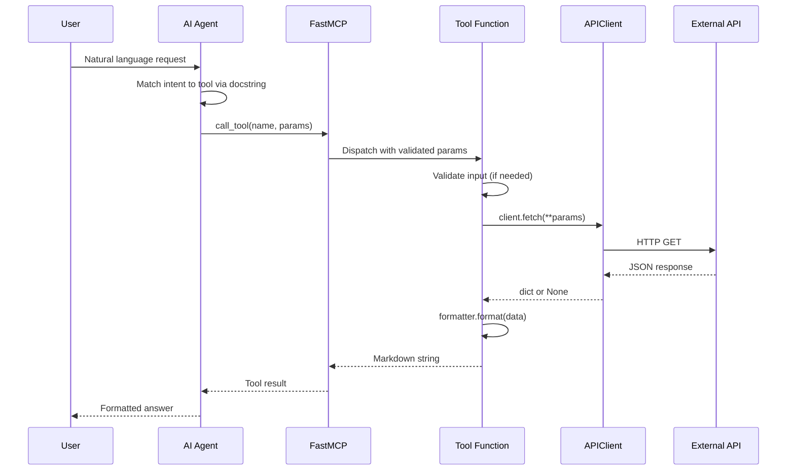

# Adding Tools and Resources

This guide covers adding new tools and resources to an **existing** service plugin. If you need to add an entirely new API, see [Adding a New API Service](ADDING-A-SERVICE.md) first.

---

## Table of Contents

- [Anatomy of a Tool](#anatomy-of-a-tool)
- [Anatomy of a Resource](#anatomy-of-a-resource)
- [Writing Effective Docstrings](#writing-effective-docstrings)
- [Parameter Handling](#parameter-handling)
- [Validation Patterns](#validation-patterns)
- [Error Handling Patterns](#error-handling-patterns)
- [Worked Example: Date Range Tool](#worked-example-date-range-tool)

---

## How a Tool Invocation Works

Before diving into the code, understand how a tool call flows through the system:



The tool docstring is what the AI agent reads at the "Match intent" step. A vague docstring means the agent will not select your tool.

---

## Anatomy of a Tool

A tool is a function that an MCP client (AI agent) can **call**. It performs an action and returns a result.

Tools are defined inside the service class's `register(mcp)` method using the `@mcp.tool()` decorator:

```python
def register(self, mcp: FastMCP) -> None:
    client = self._client
    formatter = self._formatter

    @mcp.tool()
    async def your_tool_name(param: str) -> str:
        """One-line description of what this tool does.

        Longer description that helps the AI agent understand when
        and why to call this tool. Be specific.

        Args:
            param: Description of what this parameter is and its format.
        """
        data = await client.fetch(param=param)
        if not data:
            return "Unable to fetch data."
        return formatter.format(data)
```

**Key components:**

| Component | Purpose | Required |
|-----------|---------|----------|
| `@mcp.tool()` | Registers the function as an MCP tool | Yes |
| `async def` | Tools are async because they typically make HTTP calls | Yes (for I/O tools) |
| Function name | Becomes the tool name visible to the AI agent | Yes |
| Docstring | The AI agent reads this to decide when to call the tool | Yes |
| Parameters | Typed function parameters become the tool's input schema | Optional |
| Return type `str` | Tools return Markdown strings to the client | Yes |

**Why define tools inside `register()`?**

The tool function is a closure that captures `client` and `formatter` from the enclosing scope. This keeps tools decoupled from global state and allows each service to manage its own dependencies.

---

## Anatomy of a Resource

A resource is read-only data that an MCP client can **read**. It is passive -- the agent accesses it like a reference document.

```python
@mcp.resource("your-scheme://path/to/resource")
def your_resource_name() -> str:
    """Description of what this resource provides.

    The AI agent reads this docstring to understand the resource.
    """
    return "Static or computed content here."
```

**Key components:**

| Component | Purpose | Required |
|-----------|---------|----------|
| `@mcp.resource(uri)` | Registers the function as an MCP resource at the given URI | Yes |
| URI | Unique identifier using a custom scheme (e.g. `space://events/famous-dates`) | Yes |
| `def` (not async) | Resources are typically synchronous (returning static data) | Typical |
| Return type `str` | Resources return string content | Yes |

**When to use a resource vs. a tool:**

| Use a Resource | Use a Tool |
|----------------|------------|
| Static reference data (lists, docs, schemas) | Dynamic data from an API call |
| No parameters needed | User provides input parameters |
| Content rarely changes | Content depends on runtime state |

---

## Writing Effective Docstrings

The docstring is the most important part of a tool definition. The AI agent reads the docstring and function signature to decide **when** to call the tool and **how** to provide arguments.

**Good docstring -- specific and actionable:**

```python
@mcp.tool()
async def get_space_photo_by_date(date: str) -> str:
    """Get the Astronomy Picture of the Day for a specific date (YYYY-MM-DD).

    Retrieves the NASA APOD entry for the given date, including the title,
    explanation, media type, and link. The date must be between 1995-06-16
    (the first APOD) and today.

    Args:
        date: Date in YYYY-MM-DD format (e.g. "2024-01-15"). Must be
              between 1995-06-16 and today.
    """
```

**Bad docstring -- vague and unhelpful:**

```python
@mcp.tool()
async def get_photo(d: str) -> str:
    """Get a photo."""
```

**Docstring checklist:**

- [ ] First line: one sentence describing what the tool does
- [ ] Mention the expected parameter format (e.g. `YYYY-MM-DD`)
- [ ] Mention any constraints (date ranges, valid values, rate limits)
- [ ] Describe what the return value contains
- [ ] Use natural language the AI agent can reason about

---

## Parameter Handling

Tool parameters are defined as function arguments with type annotations. FastMCP automatically generates the input schema from these annotations.

**Supported types:**

```python
async def tool_with_string(name: str) -> str: ...
async def tool_with_int(count: int) -> str: ...
async def tool_with_float(latitude: float) -> str: ...
async def tool_with_bool(include_details: bool) -> str: ...
```

**Optional parameters:**

```python
from typing import Optional

async def tool_with_optional(date: Optional[str] = None) -> str:
    """If date is not provided, returns today's data."""
    if date is None:
        date = datetime.now().strftime("%Y-%m-%d")
    ...
```

**Multiple parameters:**

```python
async def tool_with_multiple(start_date: str, end_date: str) -> str:
    """Get data for a date range.

    Args:
        start_date: Start date in YYYY-MM-DD format.
        end_date: End date in YYYY-MM-DD format (max 7 days from start).
    """
```

**Rules:**

- Use descriptive parameter names (`date`, `query`, `latitude` -- not `d`, `q`, `x`).
- Document every parameter in the docstring `Args:` section.
- Document format expectations and constraints inline.

---

## Validation Patterns

Input validation should happen at the top of the tool function, before any API call. Return a user-friendly error string immediately if validation fails.

**Pattern: Inline validation**

For simple checks, validate directly in the tool function:

```python
@mcp.tool()
async def get_data_by_id(item_id: str) -> str:
    """Get data for a specific item by ID."""
    if not item_id.strip():
        return "Please provide a non-empty item ID."

    data = await client.fetch(id=item_id)
    ...
```

**Pattern: Extracted validation function**

For complex validation (date parsing, range checks, regex), extract into a dedicated validation module:

```python
def validate_apod_date(date_str: str) -> datetime | str:
    """Parse and validate a date string for the APOD archive.

    Returns:
        The parsed datetime on success, or a human-readable error
        message string when validation fails.
    """
    try:
        parsed = datetime.strptime(date_str, DATE_FORMAT)
    except ValueError:
        return "Invalid date format. Use YYYY-MM-DD"

    if parsed < FIRST_APOD_DATE:
        return "Date must be between 1995-06-16 and today"

    if parsed > datetime.now():
        return "Date must be between 1995-06-16 and today"

    return parsed
```

Then use it in the tool:

```python
@mcp.tool()
async def get_space_photo_by_date(date: str) -> str:
    """Get the APOD for a specific date (YYYY-MM-DD)."""
    result = validate_apod_date(date)
    if isinstance(result, str):
        return result

    data = await client.fetch(date=date)
    ...
```

**Key principle:** Validation functions return the parsed value on success or an error string on failure. The tool checks the type and short-circuits on error.

---

## Error Handling Patterns

Tools must never raise exceptions. Every error path returns a human-readable string.

**Pattern: Client returns None**

```python
data = await client.fetch(date=date)
if not data:
    return "Unable to fetch data. The API may be temporarily unavailable."
return formatter.format(data)
```

**Pattern: Validation failure**

```python
result = validate_input(user_input)
if isinstance(result, str):
    return result
```

**Pattern: Multiple API calls**

```python
primary = await client.fetch(id=item_id)
if not primary:
    return "Unable to fetch primary data."

related = await client.fetch(related_to=item_id)
if not related:
    return formatter.format(primary)

return formatter.format_with_related(primary, related)
```

**Rules:**

- Never let exceptions propagate out of a tool function.
- Return specific, helpful error messages (not stack traces).
- Degrade gracefully -- if secondary data fails, return what you have.

---

## Worked Example: Date Range Tool

Adding a `get_space_photos_date_range` tool to the existing APOD service.

### 1. Add validation (optional, in `validation.py`)

```python
def validate_date_range(start_str: str, end_str: str) -> tuple[str, str] | str:
    """Validate a start/end date pair for a range query.

    Returns:
        A (start, end) tuple of date strings on success, or a
        human-readable error message on failure.
    """
    start_result = validate_apod_date(start_str)
    if isinstance(start_result, str):
        return start_result

    end_result = validate_apod_date(end_str)
    if isinstance(end_result, str):
        return end_result

    if start_result > end_result:
        return "Start date must be before end date."

    if (end_result - start_result).days > 7:
        return "Date range too large. Maximum 7 days."

    return (start_str, end_str)
```

### 2. Add the tool (in `ApodService.register`)

```python
@mcp.tool()
async def get_space_photos_date_range(start_date: str, end_date: str) -> str:
    """Get multiple Astronomy Pictures of the Day for a date range.

    Retrieves APOD entries for each day between start_date and
    end_date (inclusive). Maximum range is 7 days.

    Args:
        start_date: Start date in YYYY-MM-DD format.
        end_date: End date in YYYY-MM-DD format (max 7 days from start).
    """
    result = validate_date_range(start_date, end_date)
    if isinstance(result, str):
        return result

    data = await client.fetch(start_date=start_date, end_date=end_date)
    if not data:
        return f"Unable to fetch photos for {start_date} to {end_date}."
    return formatter.format_range(data)
```

### 3. Add a test

```python
@respx.mock
async def test_date_range_tool(self, mcp_server) -> None:
    sample_range = [SAMPLE_APOD, SAMPLE_APOD]
    respx.get(NASA_APOD_BASE_URL).mock(
        return_value=httpx.Response(200, json=sample_range)
    )
    result_tuple = await mcp_server.call_tool(
        "get_space_photos_date_range",
        {"start_date": "2024-06-10", "end_date": "2024-06-12"},
    )
    text = result_tuple[0][0].text
    assert SAMPLE_APOD["title"] in text
```

### 4. Update the Cursor rule

If you add a new tool, update `.cursor/rules/mcp-factory-tools.mdc` to include it in the tool usage table so the AI agent knows when to call it.
