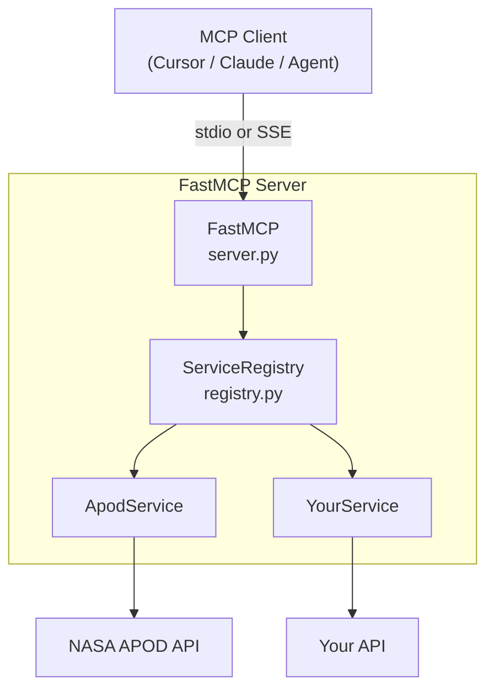
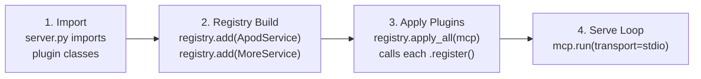
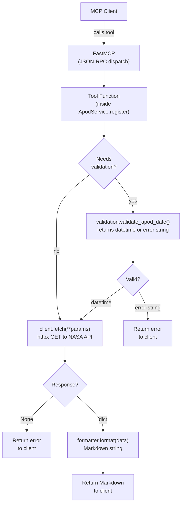
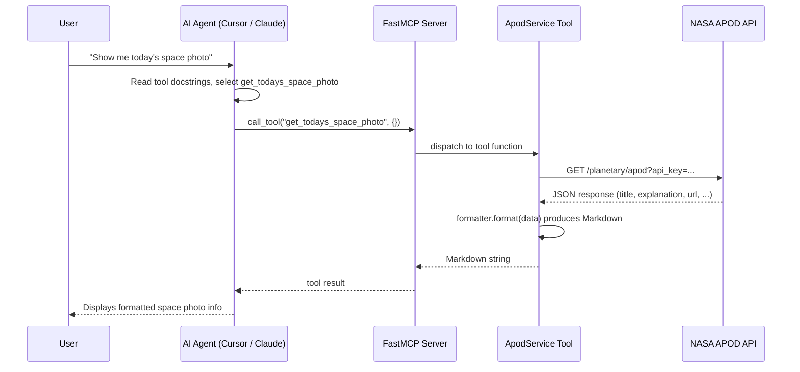
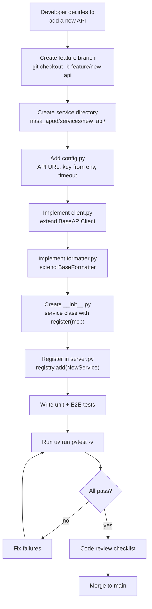
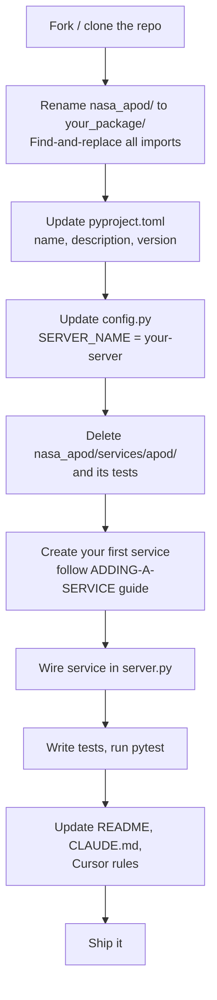

# Architecture

This document is the single source of truth for the structural design of MCP Factory. It covers the high-level system context, the service plugin lifecycle, the runtime data flow, how SOLID principles are applied, and a responsibility map for every module.

---

## System Context



**FastMCP** is the MCP protocol runtime (JSON-RPC over stdio or SSE). It holds all registered tools and resources.

**ServiceRegistry** is the factory that collects `ServicePlugin` instances and applies them to the FastMCP server at startup. It owns no business logic -- it delegates entirely to the plugins.

**ServicePlugin** (any plugin) owns its own client, formatter, config, and validation. It registers its tools and resources onto the FastMCP instance during the `register(mcp)` call.

---

## Plugin Lifecycle

The server boots in four phases:



1. **Import time** -- `nasa_apod/server.py` imports concrete service classes (`ApodService`, etc.) and creates the `FastMCP` instance.
2. **Registry build** -- Each service is instantiated and added to the `ServiceRegistry` via `registry.add(...)`.
3. **Apply plugins** -- `registry.apply_all(mcp)` iterates the plugins in registration order and calls `plugin.register(mcp)` on each. Inside `register`, the plugin uses `@mcp.tool()` and `@mcp.resource()` decorators to wire its endpoints.
4. **Serve loop** -- `main.py` calls `mcp.run(transport="stdio")` and the server enters the JSON-RPC event loop.

Adding a new API service touches **only** phases 1 and 2: import the new service class and call `registry.add(...)`. Phases 3 and 4 require zero changes.

---

## Data Flow

When an MCP client calls a tool (e.g. `get_todays_space_photo`):



Key rules:
- Tool functions never raise exceptions. They return human-readable error strings.
- `client.fetch()` returns `None` on any HTTP or network error. The tool function checks for `None` and returns an error message.
- `formatter.format()` is a pure function: data in, Markdown out. No I/O.

---

## User Flows

### End User: Asking for a Space Photo

This is the experience from the end user's perspective when they ask an AI assistant for a space photo.



### Developer: Adding a New API Service

This is the workflow a developer follows to extend the server with a new API.



### Developer: Forking as a New Project

This is the workflow for using this repo as a template for an entirely different MCP server.



---

## Module Responsibility Map

| Module | Responsibility |
|--------|----------------|
| `main.py` | Entry point. Imports `mcp` from `server.py` and calls `mcp.run()`. |
| `nasa_apod/__init__.py` | Package marker. No logic. |
| `nasa_apod/config.py` | Global server-wide settings (`SERVER_NAME`). |
| `nasa_apod/server.py` | Creates `FastMCP`, builds `ServiceRegistry`, adds plugins, applies them. |
| `nasa_apod/services/__init__.py` | Package marker for service infrastructure. |
| `nasa_apod/services/base.py` | Abstract base classes (`BaseAPIClient`, `BaseFormatter`) and `ServicePlugin` protocol. |
| `nasa_apod/services/registry.py` | `ServiceRegistry` -- collects and applies plugins. |
| `nasa_apod/services/apod/__init__.py` | `ApodService` -- implements `ServicePlugin`, registers APOD tools and resources. |
| `nasa_apod/services/apod/config.py` | APOD-specific constants: base URL, API key, first date, timeout. |
| `nasa_apod/services/apod/client.py` | `ApodClient` -- extends `BaseAPIClient`, performs HTTP requests to NASA. |
| `nasa_apod/services/apod/formatter.py` | `ApodFormatter` -- extends `BaseFormatter`, renders Markdown from APOD data. |
| `nasa_apod/services/apod/validation.py` | `validate_apod_date()` -- date parsing and range checking. |

---

## SOLID Principles Applied

| Principle | Where Applied | How |
|-----------|---------------|-----|
| **Single Responsibility** | Every module in the table above | Each file has exactly one reason to change. Config changes? Edit `config.py`. HTTP logic? Edit `client.py`. Output format? Edit `formatter.py`. |
| **Open/Closed** | `ServiceRegistry` + `ServicePlugin` protocol | New services are added by implementing the protocol and calling `registry.add(...)`. Existing code is never modified. |
| **Liskov Substitution** | `BaseAPIClient` and `BaseFormatter` ABCs | Any subclass of `BaseAPIClient` can replace `ApodClient` wherever the base type is expected. The same applies to formatters. |
| **Interface Segregation** | `ServicePlugin` protocol | The protocol requires only one method: `register(mcp)`. Plugins are not forced to implement unrelated interfaces. |
| **Dependency Inversion** | `ApodService` composes abstractions | `ApodService.__init__` creates concrete instances, but the tool functions interact through the base class contracts (`client.fetch`, `formatter.format`). The registry depends on the `ServicePlugin` protocol, not on concrete service classes. |

---

## Key Abstractions

### BaseAPIClient (`nasa_apod/services/base.py`)

```python
class BaseAPIClient(ABC):
    def __init__(self, base_url: str, api_key: str, timeout: float = 30.0)
    async def fetch(self, **params: str) -> dict[str, Any] | None  # abstract
```

Stores connection parameters. Subclasses implement `fetch()` to perform the actual HTTP request and return parsed JSON or `None`.

### BaseFormatter (`nasa_apod/services/base.py`)

```python
class BaseFormatter(ABC):
    def format(self, data: dict[str, Any], **kwargs: Any) -> str  # abstract
```

Pure function contract. Takes API response data, returns a Markdown string.

### ServicePlugin (`nasa_apod/services/base.py`)

```python
class ServicePlugin(Protocol):
    def register(self, mcp: FastMCP) -> None: ...
```

Structural protocol (duck typing). Any class with a `register(mcp)` method qualifies. No inheritance required.

### ServiceRegistry (`nasa_apod/services/registry.py`)

```python
class ServiceRegistry:
    def add(self, plugin: ServicePlugin) -> None
    def apply_all(self, mcp: FastMCP) -> None
    @property
    def plugins(self) -> list[ServicePlugin]
```

Collects plugins, applies them in order. The single integration point between FastMCP and all services.

---

## Test Architecture

```
tests/
├── test_base.py              ABC contract tests (BaseAPIClient, BaseFormatter)
├── test_registry.py          ServiceRegistry factory tests
├── test_apod_config.py       APOD config constants
├── test_apod_client.py       ApodClient with HTTP mocking (respx)
├── test_apod_formatter.py    ApodFormatter output verification
├── test_apod_validation.py   Date validation edge cases
└── test_e2e.py               Full server bootstrap + tool execution
```

**Unit tests** cover individual modules in isolation. HTTP is mocked with `respx`. No network calls.

**End-to-end tests** build a real `FastMCP` + `ServiceRegistry` + `ApodService` stack. They call tools through the MCP interface (`mcp_server.call_tool(...)`) and verify output format, error handling, and resource access.

The E2E suite is the contract test for "no breaking changes" -- if all E2E tests pass after a change, the external MCP interface is intact.
