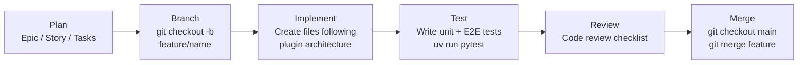
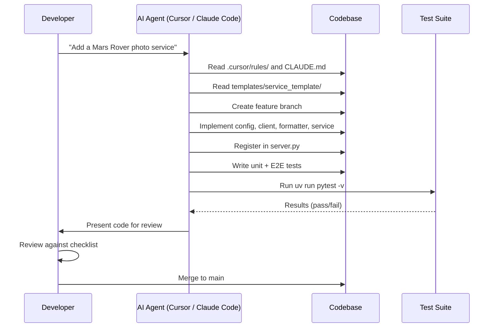
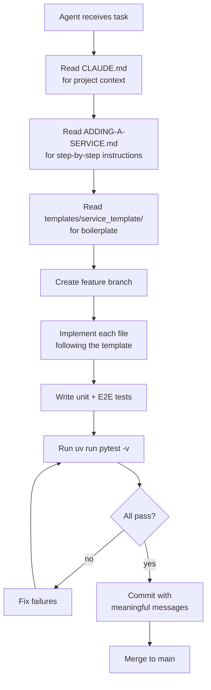

# Development Workflow

This document describes the end-to-end process for incorporating a new feature into the codebase -- from planning through merge. It applies whether you are working manually, with AI assistance (Cursor, Claude Code), or through a fully agentic framework.

---

## End-to-End Flow



---

## 1. Planning

Before writing code, structure the work:

**Epic** -- The broad capability (e.g. "Mars Rover Photo Integration").

**User Story** -- A testable outcome in the form: "As a [role], I want [goal] so that [benefit]."

Example:
> As a user, I want to ask for Mars Rover photos so that I can explore images from the Martian surface.

**Tasks** -- Concrete implementation steps. For a new service, these map directly to the [Adding a New API Service](ADDING-A-SERVICE.md) steps:

1. Create service directory
2. Add config
3. Implement client
4. Implement formatter
5. Create service class
6. Register in server.py
7. Write unit tests
8. Write E2E tests
9. Run all tests
10. Update Cursor rules and CLAUDE.md

---

## 2. Branching

Create a feature branch from `main`:

```bash
git checkout main
git pull
git checkout -b feature/your-feature-name
```

Branch naming conventions:
- `feature/mars-rover-service` -- new functionality
- `fix/apod-date-validation` -- bug fix
- `chore/update-dependencies` -- maintenance
- `docs/add-architecture-guide` -- documentation

---

## 3. Committing

Make one commit per logical change. Each commit should be atomic -- it either fully adds a capability or fully does not.

**Good commits:**

```
Add Mars Rover service config and client
Add Mars Rover formatter and validation
Add Mars Rover service class and register in server.py
Add Mars Rover unit tests
Add Mars Rover E2E tests
```

**Bad commits:**

```
WIP
fix
updates
everything
```

**Commit message format:**

```
<verb> <what changed>

Optional longer description explaining why, if not obvious.
```

Use present tense: "Add", "Fix", "Update", "Remove" -- not "Added", "Fixed".

---

## 4. Testing Strategy

### Unit Tests

Every module gets its own test file:

| Module | Test File | What to Test |
|--------|-----------|--------------|
| `config.py` | `test_your_config.py` | Constants have expected values, env var loading works |
| `client.py` | `test_your_client.py` | Successful fetch, HTTP errors, network errors (all mocked with `respx`) |
| `formatter.py` | `test_your_formatter.py` | Output includes expected fields, optional fields handled, header support |
| `validation.py` | `test_your_validation.py` | Valid input accepted, invalid input returns error string |

### E2E Tests

E2E tests verify the full stack: `FastMCP` + `ServiceRegistry` + your service + tool invocation.

```python
@pytest.fixture()
def mcp_server():
    from mcp.server.fastmcp import FastMCP
    from your_package.config import SERVER_NAME
    from your_package.services.registry import ServiceRegistry
    from your_package.services.your_api import YourService

    server = FastMCP(SERVER_NAME)
    registry = ServiceRegistry()
    registry.add(YourService())
    registry.apply_all(server)
    return server
```

Test categories:
- **Bootstrap** -- all tools registered, all resources accessible
- **Tool execution** -- each tool returns expected output with mocked HTTP
- **Error handling** -- tools handle API failures gracefully
- **Validation** -- tools reject invalid input with helpful messages

### Running Tests

```bash
uv run pytest -v
```

All tests must pass before merging. No exceptions.

### Testing Tips

- Use `respx` to mock HTTP calls. Never make real network requests in tests.
- Use `pytest-asyncio` for async test methods.
- Create `SAMPLE_DATA` constants at the top of test files for reuse.
- Test error paths, not just happy paths.

---

## 5. Code Review Checklist

Before merging, verify:

### Architecture

- [ ] New code follows the plugin architecture (client, formatter, service class)
- [ ] Base classes are extended correctly (`BaseAPIClient`, `BaseFormatter`)
- [ ] Service class implements the `ServicePlugin` protocol
- [ ] Registration is in `server.py` and nowhere else

### SOLID Principles

- [ ] **SRP** -- Each file has a single responsibility
- [ ] **OCP** -- No existing files modified except `server.py` (for registration)
- [ ] **LSP** -- New subclasses are substitutable for their base types
- [ ] **ISP** -- Service class only implements `register(mcp)`
- [ ] **DIP** -- Dependencies are on abstractions, not concretions

### Code Quality

- [ ] No bare `except Exception` -- use specific exception types
- [ ] No `print()` -- use `logging`
- [ ] No hardcoded secrets -- use environment variables
- [ ] All functions have docstrings (JSDoc/Docstring style)
- [ ] Type hints on all function signatures
- [ ] Tool docstrings are clear and specific for AI agent consumption

### Testing

- [ ] Unit tests for every new module
- [ ] E2E tests for the full tool execution flow
- [ ] Error paths tested (API failure, validation failure)
- [ ] All existing tests still pass (no breaking changes)
- [ ] `uv run pytest -v` shows zero failures

### Security

- [ ] API keys loaded from environment variables
- [ ] Input validated before use
- [ ] No sensitive data in error messages returned to clients
- [ ] HTTP timeouts configured (not infinite)

---

## 6. Merging

After all tests pass and the review checklist is complete:

```bash
git checkout main
git merge feature/your-feature-name
git branch -d feature/your-feature-name
```

If working with a remote, push and create a pull request instead:

```bash
git push -u origin feature/your-feature-name
# Create PR via GitHub / GitLab
# Merge after review
```

---

## Workflow for AI-Assisted Development

When using Cursor or Claude Code, the workflow is the same but the AI handles the implementation steps:



The Cursor rules and `CLAUDE.md` are designed so that AI tools produce code that follows the architecture without manual intervention.

---

## Workflow for Agentic Frameworks

Fully autonomous agents (no human in the loop) follow a self-directed loop:



The documentation is structured so that each step is unambiguous and machine-executable.
