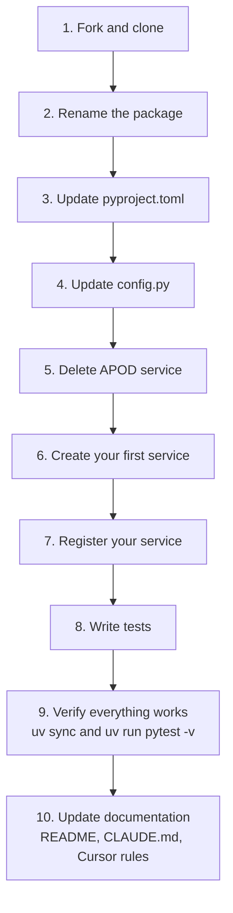

# Forking as a Template

This guide explains how to use this repository as a starting point for an **entirely new** MCP server project. By the end you will have a clean, production-ready MCP server with the same plugin architecture, test infrastructure, and development workflow -- but serving your own API.

---

## What You Get

When you fork this repo, you inherit:

- **Plugin architecture** -- `BaseAPIClient`, `BaseFormatter`, `ServicePlugin`, `ServiceRegistry`
- **Server wiring** -- `server.py` with registry-based plugin loading
- **Test infrastructure** -- `pytest` + `pytest-asyncio` + `respx`, with unit and E2E patterns
- **Entry point** -- `main.py` with stdio transport
- **Dependency management** -- `pyproject.toml` with `uv` lock file
- **Documentation templates** -- architecture docs, guides, Cursor rules, `CLAUDE.md`

---

## What to Rename

| Item | Current Value | Change To |
|------|---------------|-----------|
| Root package directory | `mcp_factory/` | `your_package/` |
| `pyproject.toml` `name` | `mcp-factory` | `your-project-name` |
| `pyproject.toml` `description` | MCP server for NASA APOD | Your description |
| `mcp_factory/config.py` `SERVER_NAME` | `"mcp-factory"` | `"your-server-name"` |
| `.cursor/rules/mcp-factory-tools.mdc` | APOD-specific tool routing | Your tool routing |
| `CLAUDE.md` | References NASA APOD | Your project context |
| `README.md` | NASA APOD documentation | Your project documentation |

### Renaming the package

The cleanest approach is a project-wide find-and-replace:

```bash
# 1. Rename the directory
mv mcp_factory your_package

# 2. Replace all imports
# In every .py file, replace "mcp_factory" with "your_package"
# In every .mdc file, replace "mcp_factory" with "your_package"

# 3. Update pyproject.toml
# Change name, description, and version
```

---

## What to Keep

These files form the reusable framework. Keep them (updating imports after the rename):

| File | Purpose |
|------|---------|
| `main.py` | Entry point (only change: import path) |
| `your_package/__init__.py` | Package marker |
| `your_package/config.py` | Global server config (`SERVER_NAME`) |
| `your_package/server.py` | Registry-based server wiring |
| `your_package/services/__init__.py` | Services package marker |
| `your_package/services/base.py` | Base abstractions (`BaseAPIClient`, `BaseFormatter`, `ServicePlugin`) |
| `your_package/services/registry.py` | `ServiceRegistry` factory |
| `tests/__init__.py` | Tests package marker |
| `tests/test_base.py` | ABC contract tests |
| `tests/test_registry.py` | Registry factory tests |
| `pyproject.toml` | Dependency management (update metadata) |

---

## What to Delete

Remove the APOD-specific service and its tests -- you will replace them with your own:

```bash
rm -rf your_package/services/apod/
rm tests/test_apod_config.py
rm tests/test_apod_client.py
rm tests/test_apod_formatter.py
rm tests/test_apod_validation.py
rm tests/test_e2e.py
```

You will recreate E2E tests for your own service.

---

## What to Update

### `your_package/server.py`

Replace the APOD import and registration with your own service:

```python
from mcp.server.fastmcp import FastMCP

from your_package.config import SERVER_NAME
from your_package.services.your_api import YourService
from your_package.services.registry import ServiceRegistry

mcp = FastMCP(SERVER_NAME)

registry = ServiceRegistry()
registry.add(YourService())
registry.apply_all(mcp)
```

### `your_package/services/base.py`

Typically no changes needed. The base abstractions are API-agnostic. If your API uses a different authentication pattern (OAuth, headers instead of query params), you may want to adjust `BaseAPIClient.__init__` or add a new base class.

### `.cursor/rules/`

Update or replace rule files to reflect your new tools and when the AI should use them.

### `CLAUDE.md`

Rewrite to describe your project, its architecture, and its tools.

---

## Zero-to-Production Checklist



Follow these 10 steps to go from fork to working MCP server:

**1. Fork and clone**

```bash
git clone <your-fork-url>
cd your-project
```

**2. Rename the package**

Rename `mcp_factory/` to your package name. Find-and-replace all imports.

**3. Update `pyproject.toml`**

Set your project name, description, version, and any additional dependencies your API requires.

**4. Update `config.py`**

Set `SERVER_NAME` to your server name.

**5. Delete the APOD service**

Remove `your_package/services/apod/` and its corresponding tests.

**6. Create your first service**

Follow the [Adding a New API Service](ADDING-A-SERVICE.md) guide to create your service under `your_package/services/your_api/`.

**7. Register your service**

Update `your_package/server.py` to import and register your service.

**8. Write tests**

Create unit tests for your client, formatter, and validation. Create E2E tests for the full server.

**9. Verify everything works**

```bash
uv sync
uv run pytest -v
uv run main.py  # test server starts without errors
```

**10. Update documentation**

- Rewrite `README.md` for your project
- Update `.cursor/rules/` with your tool routing
- Rewrite `CLAUDE.md` for your project context
- Update or remove docs under `docs/` as appropriate

---

## Example: Converting to a Weather MCP

To illustrate, here is how the structure maps for a hypothetical Weather MCP:

```
weather_mcp/
├── __init__.py
├── config.py                       # SERVER_NAME = "weather"
├── server.py                       # registry.add(OpenWeatherService())
└── services/
    ├── __init__.py
    ├── base.py                     # unchanged from template
    ├── registry.py                 # unchanged from template
    └── openweather/
        ├── __init__.py             # OpenWeatherService.register(mcp)
        ├── config.py               # OPENWEATHER_BASE_URL, API_KEY
        ├── client.py               # OpenWeatherClient(BaseAPIClient)
        ├── formatter.py            # WeatherFormatter(BaseFormatter)
        └── validation.py           # validate_city_name(), validate_coordinates()
```

Tools registered:
- `get_current_weather(city: str) -> str`
- `get_weather_forecast(city: str, days: int) -> str`
- `get_weather_by_coordinates(lat: float, lon: float) -> str`

Resources:
- `weather://reference/supported-cities` -- list of major cities

The pattern is identical. The only things that change are the domain-specific files under `services/openweather/`.

---

## Example: Converting to a Database MCP

For a non-REST use case, the pattern still applies:

```
db_mcp/
├── __init__.py
├── config.py                       # SERVER_NAME = "database"
├── server.py                       # registry.add(PostgresService())
└── services/
    ├── __init__.py
    ├── base.py                     # may add a BaseQueryClient ABC
    ├── registry.py                 # unchanged
    └── postgres/
        ├── __init__.py             # PostgresService.register(mcp)
        ├── config.py               # DATABASE_URL, POOL_SIZE
        ├── client.py               # PostgresClient(BaseQueryClient)
        ├── formatter.py            # TableFormatter(BaseFormatter)
        └── validation.py           # validate_query(), sanitize_input()
```

For non-HTTP APIs, extend `BaseAPIClient` or create a sibling base class (e.g. `BaseQueryClient`) in `base.py`. The plugin architecture and registry pattern remain the same.
